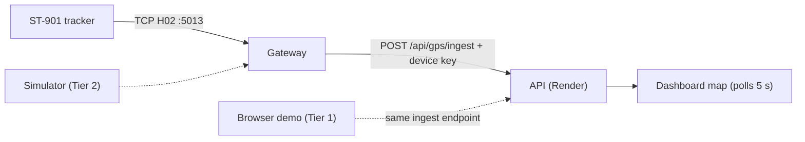

# GPS Deployment Runbook

One guide, three tiers. Climb only as far as the day requires:

| Tier | What it proves | Needs | Time |
|---|---|---|---|
| **1 — Browser demo** | Map works on the deployed site | Two env vars | ~5 min |
| **2 — Simulator pipeline** | The real gateway → API path works | Laptop + repo | ~15 min |
| **3 — Real hardware** | Live ST-901 trackers in vehicles | Oracle VM + tracker + SIM | ~half a day |



Positions flow into `/api/gps/ingest` authenticated by a shared device key; the map polls the latest point per vehicle every 5 seconds. Tiers 1–2 fake the tracker at different depths; Tier 3 is the real thing.

---

## 0. Once-only setup

1. Generate a secret: `openssl rand -hex 24`
2. **Render** → API service → Environment → `GPS_DEVICE_API_KEY=<secret>` → save.
3. **Vercel** → FE project → Settings → Environment Variables → `VITE_GPS_DEVICE_KEY=<same secret>` → redeploy the FE (Vite bakes env at build).

**✓ Verify:** `curl -X POST https://YOUR-API.onrender.com/api/gps/ingest -H "x-device-api-key: wrong"` returns 401 (not 500 — a 500 means the key isn't set).

---

## Tier 1 — Browser demo

1. Open the deployed dashboard as `admin@mms.local`.
2. Vehicle Tracking card → **Start Demo**.

**✓ Verify:** a marker drives through Davao City on the map.

If it doesn't: `VITE_GPS_DEVICE_KEY` missing/mismatched or FE not redeployed after setting it — check the browser console for 401s on `/api/gps/ingest`.

---

## Tier 2 — Simulator through the real gateway

Runs the actual gateway on your laptop, pointed at the deployed API.

1. Create `apps/gps-gateway/.env`:
   ```ini
   GATEWAY_TCP_PORT=5013
   MMS_API_URL=https://YOUR-API.onrender.com
   GPS_DEVICE_API_KEY=<the secret from step 0>
   SPEED_UNIT=knots
   ```
2. Register the fake device: web app → **Trackers → Register Device** — IMEI `1234567890`, assign a vehicle, status Active.
3. Terminal 1: `pnpm --filter @mms/gps-gateway dev` → wait for `listening on tcp/5013`.
4. Terminal 2: `pnpm --filter @mms/gps-gateway simulate 1234567890`.

**✓ Verify:** gateway logs show forwarded positions; the assigned vehicle moves on the deployed map within ~10 s.

> Registered the device *after* starting the gateway? Restart the gateway — it caches "unknown device" answers for 5 minutes.

---

## Tier 3 — Real ST-901 hardware

The tracker dials a public IP over TCP, so the gateway moves to an always-free Oracle VM. **The ST-901 is 2G-only** — confirm 2G coverage with your telco first (ST-901L is the 4G variant).

### 3.1 Provision the VM

1. Sign up at oracle.com/cloud/free — home region **Singapore** (unchangeable later).
2. Compute → Instances → Create: **Ubuntu 24.04**, shape **VM.Standard.E2.1.Micro** (always free, no capacity waitlists), default VCN, public IPv4 on. Save the SSH private key.
3. Note the public IP — `VM_IP` everywhere below.

### 3.2 Open TCP 5013 — two firewalls, both mandatory

**Cloud:** instance page → subnet link → Security Lists → Default → Add Ingress Rule: source `0.0.0.0/0`, TCP, destination port `5013`.

**VM (Oracle's Ubuntu ships restrictive iptables):**
```bash
ssh -i <key> ubuntu@VM_IP
sudo iptables -I INPUT 6 -m state --state NEW -p tcp --dport 5013 -j ACCEPT
sudo netfilter-persistent save
```

### 3.3 Install the gateway

```bash
sudo apt-get update && sudo apt-get install -y git
curl -fsSL https://deb.nodesource.com/setup_22.x | sudo -E bash -
sudo apt-get install -y nodejs
sudo corepack enable

git clone https://github.com/Code-Box-Studios/motorpool-management-system-web.git
cd motorpool-management-system-web
pnpm install --frozen-lockfile
pnpm --filter @mms/gps-gateway build

cat > apps/gps-gateway/.env <<'EOF'
GATEWAY_TCP_PORT=5013
MMS_API_URL=https://YOUR-API.onrender.com
GPS_DEVICE_API_KEY=THE-SECRET-FROM-STEP-0
SPEED_UNIT=knots
EOF
```

Run it under systemd:

```bash
sudo tee /etc/systemd/system/mms-gps-gateway.service > /dev/null <<'EOF'
[Unit]
Description=MMS GPS gateway (H02 TCP -> API ingest)
After=network-online.target
Wants=network-online.target

[Service]
User=ubuntu
WorkingDirectory=/home/ubuntu/motorpool-management-system-web/apps/gps-gateway
ExecStart=/usr/bin/node dist/main.js
Restart=always
RestartSec=5

[Install]
WantedBy=multi-user.target
EOF
sudo systemctl daemon-reload
sudo systemctl enable --now mms-gps-gateway
```

**✓ Verify:** `journalctl -u mms-gps-gateway -f` shows `GPS gateway listening on tcp/5013`.

### 3.4 Smoke test from your laptop

```bash
pnpm --filter @mms/gps-gateway simulate 1234567890 VM_IP 5013
```

**✓ Verify:** vehicle moves on the deployed map (device from Tier 2 still registered). This proves ports, key, API, and map — only the physical tracker remains.

### 3.5 Configure the tracker by SMS

Insert the SIM (has load + data, tested in a phone), power the device on 12 V. Default password `0000`; each accepted command replies **SET OK**.

| Purpose | SMS | Notes |
|---|---|---|
| APN | `8030000 <apn>` | from your telco; with credentials: `8030000 <apn> <user> <pass>` |
| Server | `8040000 VM_IP 5013` | space-separated |
| Interval, ignition ON | `8050000 20` | seconds — default fine |
| Interval, ignition OFF | `8090000 300` | seconds — default fine |

Take the tracker outdoors; first GPS fix can take minutes.

### 3.6 Register the real device

H02 trackers often send a device ID that is **not** the full IMEI — read it, don't guess:

1. `journalctl -u mms-gps-gateway -f` → the "unregistered/unassigned" warning contains the exact ID the device sends.
2. Register that ID: **Trackers → Register Device**, assign the vehicle, Active. (One active device per vehicle — deactivate the Tier-2 fake on that vehicle first.)
3. `sudo systemctl restart mms-gps-gateway` (clears the 5-min cache).

**✓ Verify:** frames from the device's ID in the logs; marker live on the map; Trackers page shows Online.

---

## Troubleshooting (all tiers)

| Tier | Symptom | Fix |
|---|---|---|
| 1 | Start Demo does nothing / console 401s | `VITE_GPS_DEVICE_KEY` wrong or FE not redeployed after setting it |
| any | Ingest returns 500 `GPS_NOT_CONFIGURED` | `GPS_DEVICE_API_KEY` not set on Render |
| 2–3 | Gateway logs "unregistered/unassigned" | Register the exact logged ID, then restart the gateway (5-min cache) |
| 2–3 | Forwarder errors / retries | Wrong `MMS_API_URL` or key; or Render asleep — gateway retries 3× then drops the point, next frames land once awake. Wake the API before demos |
| 3 | No SMS reply from tracker | SIM lacks load/SMS or device unpowered — test SIM in a phone |
| 3 | SET OK but nothing reaches the VM | Wrong APN, no data plan, or no 2G coverage; re-test port with the simulator from a phone hotspot |
| 3 | `dropping void fix` forever | No GPS lock — outdoors, wait minutes |
| 3 | Speeds ~2× off | Flip `SPEED_UNIT` between `knots` and `kmh`, restart |
| 3 | Online dot flaps while device reports | Known quirk: last-seen refreshes only on cache misses (≤5-min lag). Trust the map |

## Ops

- Logs: `journalctl -u mms-gps-gateway -f`
- Update: `cd ~/motorpool-management-system-web && git pull && pnpm install --frozen-lockfile && pnpm --filter @mms/gps-gateway build && sudo systemctl restart mms-gps-gateway`
- Costs: everything free except SIM data (a few MB/day per tracker).
