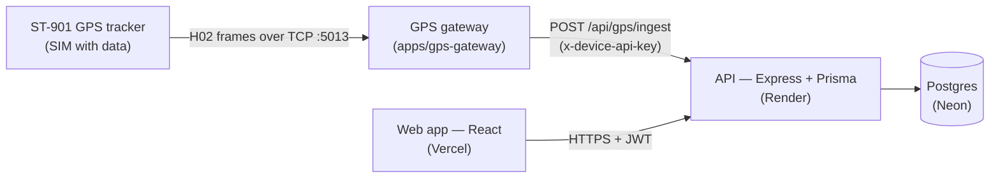
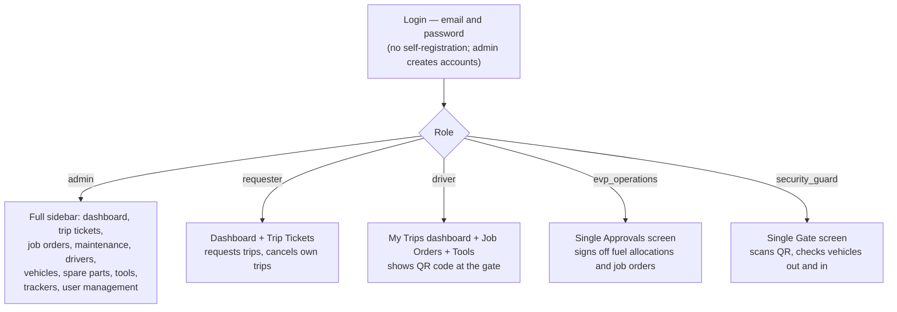
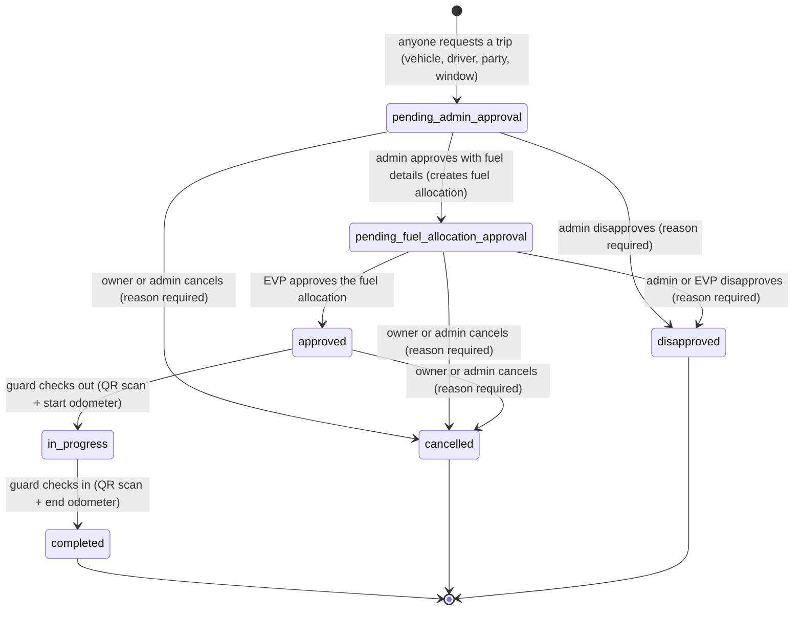
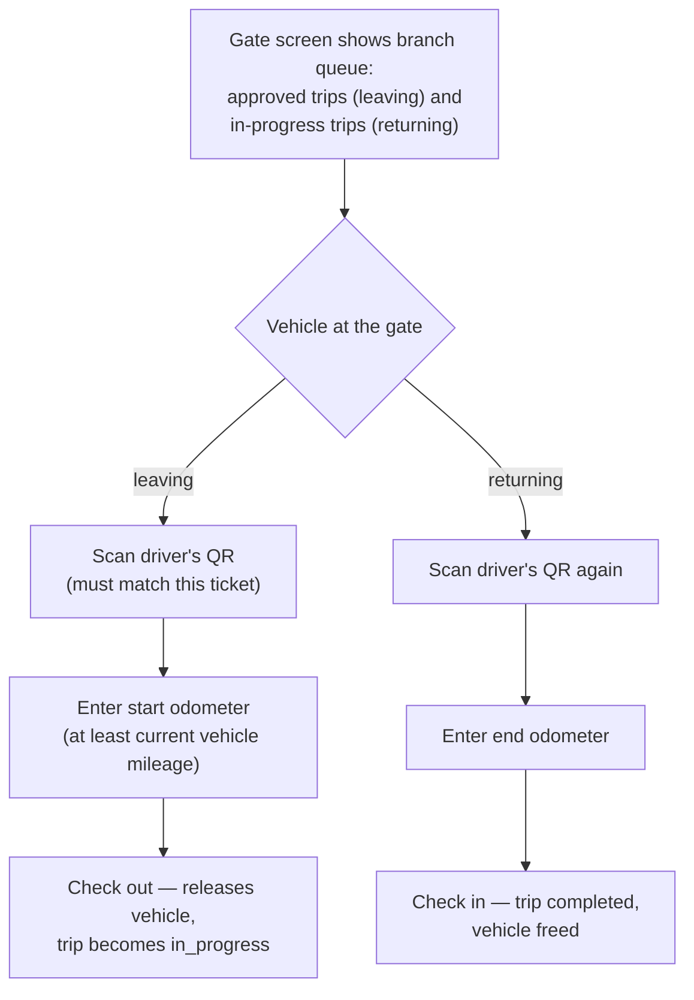
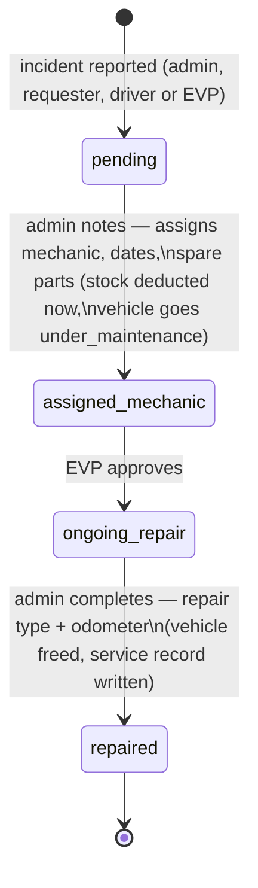
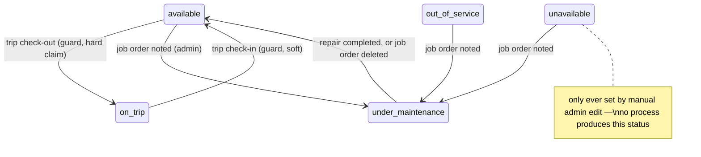
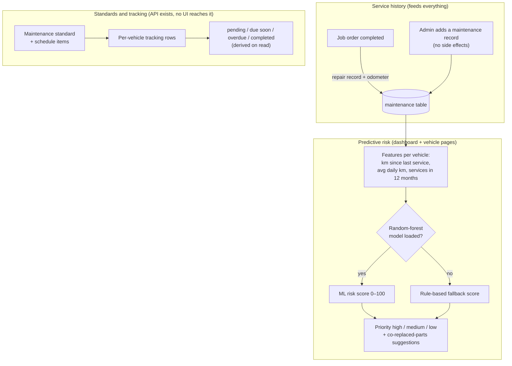
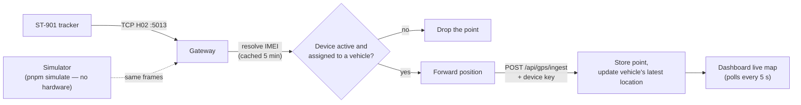
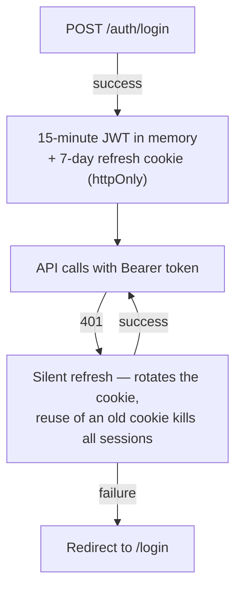

# MMS — How the App Works, Process by Process

Flowcharts generated from the actual code (API routers, state machines, and web pages), not from documentation. Statuses are the exact database values; every arrow is a real endpoint or UI action. A findings section at the end lists where the flows don't quite add up.

---

## 1. The system at a glance

The web app never touches the database directly; the tracker never touches the API directly. Everything funnels through the API.

---

## 2. Who does what (the five roles)

EVP and the guard get focused single-screen shells with no sidebar — they are approval/gate kiosks, not browsing users.

---

## 3. Trip ticket lifecycle (the core process)

Side effects along the way:

- **Create** — server enforces: valid time window, vehicle not out of service, headcount within vehicle capacity, driver active, no double-booking of vehicle *or* driver against other live trips.
- **Admin approve** — creates the companion **fuel allocation** (pending), which is what the EVP actually signs off.
- **Guard check-out** — hard-claims the vehicle `available → on_trip` (any other vehicle state is refused at the gate) and advances the odometer.
- **Guard check-in** — completes the trip, advances the odometer (distance can never be negative), and frees the vehicle `on_trip → available` (softly — a mid-trip workshop pull wins).
- Editing is only possible while pending admin approval; deletion only by admin in that same state. Everything later must exit via cancel/disapprove so the record and reason survive.

---

## 4. The gate, from the guard's chair

The driver's only job in the system is to show the QR (their dashboard exists to display it). The guard is the physical gatekeeper; approvals happen before, paperwork after.

---

## 5. Job order (repair) lifecycle

- Spare-part stock is consumed at **note** time (commitment), not at completion — two repairs can't both claim the last part.
- Completion writes a `maintenance` history row and advances the odometer — this is what the predictive model reads as "last service".
- A vehicle that is `on_trip` cannot be noted into the workshop until it returns.

---

## 6. Vehicle status machine

An admin manual edit can additionally set any status from any state (audited, but with no reason captured). Every automated flip writes a `vehicle_status_audit` row.

---

## 7. Maintenance and the predictive model

The Python trainer in `tools/ml` exports the random forest to JSON; the API evaluates it natively and falls back to a transparent rule when the model file is absent (the UI badges which one it used).

---

## 8. GPS pipeline

Devices are registered by an admin (Trackers page): IMEI, SIM, one **active** device per vehicle enforced down to a database constraint. "Online/Offline" in the UI means "seen in the last 5 minutes".

---

## 9. Session and auth

Inactive or role-stripped accounts are rejected at login, refresh, and `/auth/me` — a demoted user's old powers survive at most 15 minutes.

---

## Does it make sense? — findings

**What holds together well:** the trip-ticket chain (request → admin → EVP → gate → return) is genuinely sound — server-enforced state machine, double-booking checks, race-safe vehicle claims, odometer that can only move forward, reasons required on every negative decision, and full audit on vehicle status flips. Job orders correctly deduct stock at commitment and feed the maintenance history that powers the predictive model. Auth is textbook (rotation, reuse detection, DB re-checks).

**Gaps worth knowing about (largest first):**

1. **Job orders have no rejection path.** EVP can only approve; a refused repair sits in `assigned_mechanic` forever. (Trip tickets got a decline-with-reason; job orders didn't.)
2. **A trip that leaves the gate can only end by coming back.** No abort from `in_progress` — a breakdown strands the ticket and keeps the vehicle `on_trip` indefinitely.
3. **The whole standards/tracking subsystem (diagram 7, third box) has no UI.** No page assigns standards or completes tracked tasks — it's API-only dead weight right now.
4. **Completing scheduled maintenance wouldn't reset the risk model anyway** — tracking completion writes neither the odometer nor a service-history row; only job-order repairs count as "service" to the predictor.
5. **Requester's dashboard calls admin-only analytics** — they get silently zeroed metric tiles and an empty GPS map (403s under the hood).
6. **Approvals don't re-check reality.** Admin/EVP approval never re-runs the booking validation — a vehicle can go out of service between request and approval, and the ticket sails through until the gate refuses it.
7. **Driver status is decorative.** `on_trip` for a *driver* is only ever set by hand; trips flip the vehicle but never the driver. Vehicle status `unavailable` is likewise an orphan no process produces.
8. **Client-side route guards only cover index pages.** Any authenticated role can deep-link into detail/add pages (forms render, then 403 at submit). The API is the real gate — but the UI over-promises.
9. **Several API capabilities have no UI at all:** trip-ticket editing and deletion, job-order edit/delete, driver creation, all delete buttons for fleet assets, GPS history/trails.
10. **GPS wrinkles:** the browser demo key ships in the public JS bundle; a freshly registered device can be ignored for up to 5 minutes (negative resolve cache); the online indicator can flap "Offline" while a device is actively streaming (last-seen only refreshes on cache misses).

None of these break the demo path; items 1, 2 and 5 are the ones most likely to come up in a live defense Q&A.
